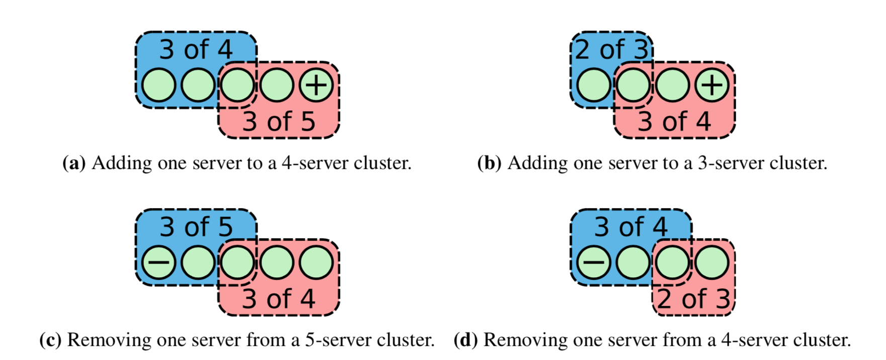
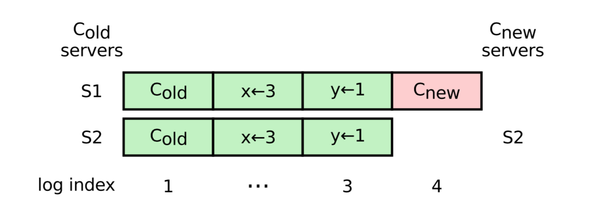
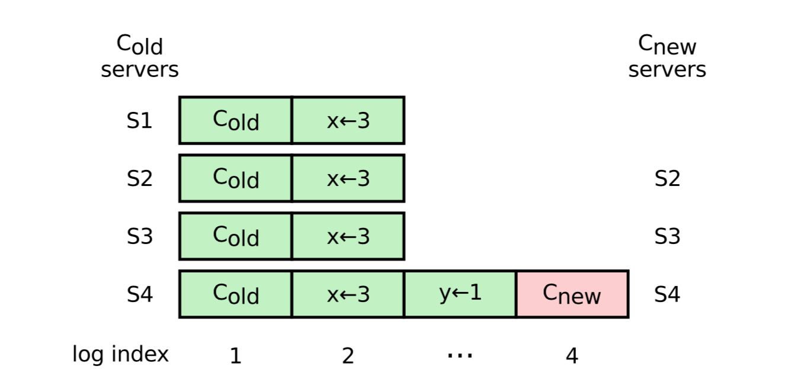
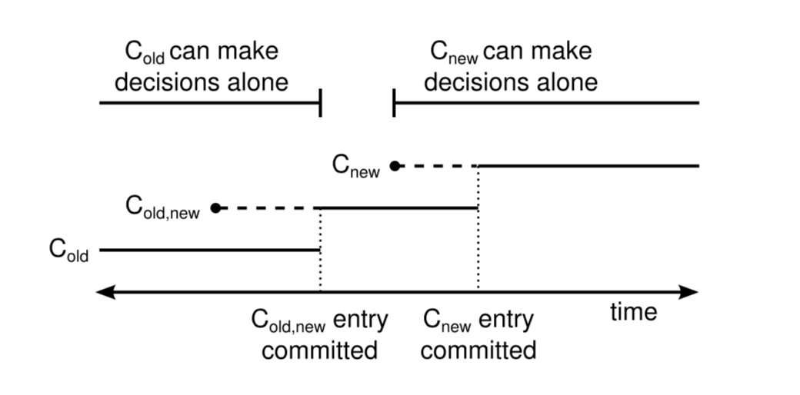

# Raft博士论文翻译

<!-- TOC -->

- [Raft博士论文翻译](#raft博士论文翻译)
    - [4 集群成员变更](#4-集群成员变更)
        - [4.1 安全](#41-安全)
        - [4.2 可用性](#42-可用性)
            - [4.2.1 让新服务器追赶](#421-让新服务器追赶)
            - [4.2.2 删除当前领导人](#422-删除当前领导人)
            - [4.2.3 破坏性服务器](#423-破坏性服务器)
            - [4.2.4 可用性参数](#424-可用性参数)
        - [4.3 使用联合共识进行任意配置变更](#43-使用联合共识进行任意配置变更)
        - [4.4 系统集成](#44-系统集成)
        - [4.5 结论](#45-结论)
    - [5 日志打包](#5-日志打包)

<!-- /TOC -->

## 4 集群成员变更

到目前为止，我们一直假设集群配置(参与共识算法的服务器集合)是固定的。实际上，在生产环境中偶尔需要变更配置，例如在服务器出现故障替换服务器时或者变更副本数时。这时可以使用以下两种方法手动完成：

* 可以通过使整个集群下线，更新配置文件，然后重启集群来变更配置。但是这将导致整个集群在配置变更期间不可用。
* 或者，新的服务器可以通过获取某个集群成员的网络地址来替换它。
然而，管理员必须保证被替换的服务器永远不会恢复，否则系统将失去其安全属性(例如，将有一个额外的投票)。

这两种成员变更的方法都有显著的缺点，而且如果有任何手动步骤都会有操作错误的风险。

为了避免这些问题，我们决定将配置变更自动化，并将它们合并 Raft 共识算法中。Raft 允许集群在配置变更期间继续正常运行，并且只需对基本共识算法进行少量扩展即可实现成员变更。图 4.1 总结了用于集群成员变更的 RPC，本章其余部分将描述其元素。

> 
图 4.1：用于变更集群成员的 RPC。AddServer RPC 用于向当前配置添加新服务器，RemoveServer RPC 用于从当前配置中删除服务器。诸如 4.1 之类的节号指出了讨论特殊功能的地方。第 4.4 节讨论了在完整系统中使用这些 RPC 的方法。

### 4.1 安全

保障安全是配置变更的首要挑战。为了确保该机制的安全，在过渡期间不能出现两位领导人同时当选的情况。如果单个配置变更添加或删除了许多服务器，则将集群从旧配置直接切换到新配置可能是不安全的；一次自动切换所有服务器是不可能的，因此集群可能在转换期间分裂成两个独立的主体（见图 4.2）。

> 
图 4.2：直接从一个配置切换到另一个配置是不安全的，因为不同的服务器将在不同的时间进行切换。在本例中，集群从 3 个服务器增长到 5 个服务器。不幸的是，在某个时间点，两个不同的领导人可以在同一个任期内被选举出来，一个拥有旧配置（Cold）的多数，另一个拥有新配置（Cnew）的多数。

大多数成员变更算法都引入了其他机制来处理这种问题。这是我们最初为 Raft 所做的，但后来我们发现了一个更简单的方法，即禁止会导致多数成员不相交的成员变更。因此，Raft 限制了允许的变更类型：一次只能从集群中添加或删除一个服务器。成员变更中更复杂的变更是通过一系列单服务器变更实现的。本章的大部分内容描述了单服务器方法，它比我们原来的方法更容易理解。为了完整起见，第 4.3 节描述了原始的方法，它增加了处理任意配置变更的复杂性。在发现更简单的单服务器变更方法之前，我们在 LogCabin 中实现了更复杂的方法；在撰写本文时，它仍然使用更复杂的方法。

当向集群中添加或删除单个服务器单个服务器时，旧集群的任何多数与新集群的任何多数重叠，参见图 4.3。这种重叠阻止了集群分裂成两个独立的多数派；在第 3.6.3 节的安全论证中，它保证了“投票人”的存在。因此，当只添加或删除一个服务器时，可以安全地直接切换到新配置。Raft 利用此属性，几乎不使用其他机制即可安全地变更集群成员。

> 
图 4.3：从偶数和奇数大小的集群中添加和删除单个服务器。在每个图中，蓝色矩形显示旧集群的大部分，红色矩形显示新集群的大部分。在每个单服务器成员变更中，旧集群的任何多数与新集群的任何多数之间都会有重叠，这用来保证安全性。例如在（b）中，旧集群的大部分必须包括其余 3 个服务器中的 2 个，而新集群的大部分必须包括新集群中的 3 个服务器，其中至少有 2 个来自旧集群。

集群配置使用复制日志中的特殊条目进行存储和通信。这利用了 Raft 的现有机制来复制和持久化配置信息。通过对配置变更和客户机请求进行排序（允许两者在管道或批处理被同时复制），它还允许集群在进行配置变更时继续为客户机请求提供服务。

当领导者收到从当前配置(Cold)中添加或删除服务器的请求时，它将新配置(Cnew)作为一个条目添加到其日志中，并使用常规的 Raft 机制复制该条目。新配置一旦添加到服务器的日志中，就会在这个服务器上生效：Cnew 条目被复制到 Cnew 指定的服务器上，而大部分服务器的新配置生效被用于确定 Cnew 条目的提交。这意味着服务器不会等待配置条目被提交，并且每个服务器总是使用在其日志中找到的最新配置。

一旦提交了 Cnew 条目，配置变更就完成了。此时，领导者知道大多数的 Cnew 指定的服务器已经采用了 Cnew。它还知道，没有收到 Cnew 条目的任意服务器都不能再构成集群的大多数，没有收到 Cnew 的服务器也不能再当选为领导者。Cnew 的提交让三件事得以继续:
1. 领导可以确认配置变更的成功完成。
2. 如果配置变更删除了服务器，则可以关闭该服务器。
3. 可以启动进一步的配置变更。在此之前，重叠的配置变更可能会降级为不安全的情况，如图 4.2 所示。

如上所述，服务器总是在其日志中使用最新的配置，而不管是否提交了配置条目。这使得领导者可以很容易地避免重叠的配置变更（上面的第三项），方法是直到之前的变更的条目提交之后才开始新的变更。只有当旧集群的大多数成员都在 Cnew 的规则下运行时，才可以安全地开始另一次成员变更。如果服务器只在了解到 Cnew 已提交时才采用 Cnew，那么 Raft 的领导者将很难知道何时旧集群的大部分已经采用它。它们需要跟踪哪些服务器知道配置变更条目的提交，服务器也需要将它们的提交索引保存到磁盘；Raft 其实不需要这些机制。相反，Raft 的每台服务器只要发现该条目存在于其日志中，就采用 Cnew，并且知道一旦提交了 Cnew 条目，就可以安全地允许进一步的配置变更。不幸的是，这个决定意味着配置变更的日志条目可以被删除（如果领导者发生变化）；在这种情况下，服务器必须准备好返回到其日志中的先前配置。

在 Raft 中，用于达成一致意见的是调用者的配置，包括投票和日志复制:
* 即使领导者并不在服务器的最新配置中，服务器依然接受它的 AppendEntries 请求。否则将永远不能将新服务器添加到集群中（它永远不会接受添加服务器的配置条目之前的任何日志条目）。
* 服务器还允许投票给不属于服务器当前最新配置的候选人(如果候选人有足够的最新日志和当前任期）。为了保持集群可用，可能偶尔需要进行投票表决。例如，考虑将第四个服务器添加到三个服务器的集群中。如果一个服务器出现故障，就需要新服务器的投票来形成多数票并选出一个领导人。

因此，服务器可以直接处理传入的 RPC 请求，而无需查询其当前配置。

### 4.2 可用性

集群成员变更在保持集群可用性方面引入了多个问题。第 4.2.1 节讨论了在将新服务器添加到集群之前使其追赶，以防止它拖延对新日志条目的提交。第 4.2.2 节介绍了如何从集群中删除现有的领导者。第 4.2.3 节介绍了如何防止已删除的服务器干扰新集群的领导者。最后，第 4.2.4 节以一个论点结束，说明为什么最终的成员变更算法足以在任何成员变更期间保留可用性。

#### 4.2.1 让新服务器追赶

当服务器被添加到集群中时，它通常不会存储任何日志条目。如果以这种状态将它添加到集群中，那么它的日志可能需要相当长的时间才能赶上领导者的日志，在此期间，集群更容易出现不可用的情况。例如，一个包含三个服务器的集群通常可以容忍一个故障而不损失可用性。但是，如果向同一集群添加了第四个服务器，其中有一个日志为空，并且原来的三个服务器之一出现故障，则集群将暂时无法提交新条目（参见图 4.4(a)）。如果一个集群中连续不断地添加许多新服务器，就会出现另一个可用性问题，此时需要新服务器来组成集群的大部分（参见图 4.4(b)）。在这两种情况下，直到新服务器的日志赶上领导者的日志之前，集群都将不可用。

> 
图 4.4：添加空日志的服务器如何使可用性面临风险的示例。图中显示了服务器在两个不同集群中的日志。每个集群都有三个服务器，S1-S3。在（a）中，添加了 S4，然后 S3 失败。集群应该能够在一个节点失败后正常运行，但事实上它失去了可用性：它需要四个服务器中的三个来提交一个新条目，但是 S3 失败了，S4 的日志太晚了，无法追加新条目。在（b）中，快速连续地添加了 S4–S6。提交添加 S6（第三个新服务器）的配置条目需要 4 个服务器的日志来存储该条目，但是 S4-S6 的日志远远不够。在新服务器的日志赶上之前，这两个集群都是不可用的。

为了避免可用性缺口，Raft 在配置变更之前引入了一个附加阶段，其中一个新服务器作为无投票权成员加入集群。领导者复制日志条目到它，但出于投票或提交目的，尚未计入多数。一旦新服务器赶上了集群的其余部分，就可以按照上面的描述进行重新配置。（支持无投票权服务器的机制在其他上下文中也很有用；例如，它可以用于将状态复制到大量服务器，这些服务器可以保证最终一致性提供只读请求。)

领导者需要确定什么时候一个新的服务器已经赶上进度从而可以继续进行配置变更。这需要注意保持可用性：如果服务器添加得太快，集群的可用性可能面临风险，如上所述。我们的目标是将任何暂时的不可用保持在一个选举超时以下，因为客户必须已经能够容忍这种程度的偶发性不可用（在领导者失败的情况下）。此外，如果可能的话，我们希望通过使新服务器的日志更接近领导者的日志来进一步减少不可用性。

如果新服务器不可用或速度太慢以至于永远无法赶上，则领导者还应中止变更。这项检查很重要：因为没有将这些检查包括在内，Lamport 的古老 Paxos 政府破裂了。他们不小心将成员变更为溺水的水手，无法再取得进步。尝试添加不可用或速度较慢的服务器通常是一个错误。实际上，我们的第一个配置变更请求就包含了网络端口号中的一个输入错误；系统正确地中止了变更并返回了一个错误。

我们建议使用以下算法来确定何时新服务器能够赶上并能被添加到集群中。将条目复制到新服务器的过程分为几轮，如图 4.5 所示。每一轮开始时都将当前领导者日志中的所有日志条目复制到新服务器的日志中。在为其当前轮复制条目时，新条目可能会到达领导者；它将在下一轮中复制它们。随着进程的进行，轮持续时间在时间上缩短。该算法等待固定的轮数（如 10 轮）。如果最后一轮的持续时间少于一个选举超时，则领导者将新服务器添加到集群中，并假设没有足够的未复制条目来创建显著的可用性缺口。否则，领导者将因错误中止配置变更。调用者可能总会再试一次（下一次成功的可能性更大，因为新服务器的日志已经追赶上一部分）。

> 
图 4.5：为了让新服务器追赶，领导者将条目复制到新服务器的过程分为几轮。每一轮结束后，新服务器就会拥有这一轮开始时领导者日志中记录的所有条目。然而，到那时，领导者可能已经收到了新的条目；这些将在下一轮中重复。

作为让新服务器追赶的第一步，领导者必须发现新服务器的日志是空的。对于新服务器，在 AppendEntries 中的一致性检查将不断失败，直到领导者的 nextIndex 最终下降到 1。这种遍历可能是影响在集群中添加新服务器的性能的主要因素（在此阶段之后，可以通过使用批处理将日志条目以更少的 RPC 传输给跟随者）。各种方法可以使 nextIndex 更快地收敛到它的正确值，包括第 3 章中描述的方法。然而，解决添加新服务器这一特殊问题的最简单方法是，使跟随者在 AppendEntries 响应中返回其日志的长度；从而使领导者可以相应地捕捉跟随者的 nextIndex。

#### 4.2.2 删除当前领导人

如果要求现有领导者将自己从集群中删除，则它必须在某个时候下台。一种简单的方法是使用第 3 章中介绍的领导权禅让扩展：被要求删除自身的领导者会将其领导权转移到另一台服务器，该服务器随后将正常执行成员变更。

我们最初为 Raft 开发了一种不同的方法，在该方法中，现有领导者进行成员变更以删除自己，然后下台。这使 Raft 处于有些尴尬的操作模式，即领导者临时管理一个它不是其成员的配置。最初，我们需要这种方法来进行任意配置变更（请参阅第 4.3 节），其中旧的配置和新的配置可能没有任何可以转移领导权的服务器，同样的方法也适用于那些没有实现领导权禅让的系统。

在这种方法中，一旦提交 Cnew 条目，从配置中删除的领导者将会下台。如果领导者在此之前下台，它可能仍会超时并再次成为领导者，从而延迟了进度。在极端情况下，从两台服务器的集群中删除领导者时，服务器甚至可能必须再次成为领导者，集群才能取得进展；参见图4.6。因此，领导者要等到 Cnew 提交再下台。这是新配置肯定可以在没有被废黜的领导者参与的情况下运行的第一点：Cnew 的成员总是有可能从他们当中选出新的领导者。被删除的领导者卸任后，Cnew 中的服务器将超时并赢得选举。这种较小的可用性缺口一般是可以容忍的，因为在领导者失败时也会出现类似的可用性缺口。

> 
图 4.6：在提交 Cnew 条目之前，已删除的服务器可能需要引导集群取得进展。 该图显示了从两个服务器集群中删除 S1。 S1 目前是负责人，S1 还不应该下台；它仍然需要作为领导者。 在 S2 收到 S1 的 Cnew 条目之前，它无法成为领导者（因为 S2 仍然需要 S1 的投票才能构成 Cold 的多数票，并且 S1 不会向 S2 投票，因为 S2 的日志不是最新的）。

这种方法对决策产生了两种影响，这些影响不是特别有害，但可能令人惊讶。首先，领导者可以在一段时间内（提交 Cnew 时）管理一个不包含自身的集群。它复制日志条目，但不占多数。其次，不属于其自身最新配置的服务器仍应开始新的选举，因为在提交 Cnew 条目之前可能仍需要它（如图 4.6 所示）。除非它是其最新配置的一部分，否则它不会在选举中计入自己的选票。

#### 4.2.3 破坏性服务器

如果没有其他机制，不在 Cnew 中的服务器可能会破坏集群。一旦集群领导者创建了 Cnew 条目，不在 Cnew 中的服务器将不再接收心跳信号，因此它将超时并开始新的选举。此外，它不会收到 Cnew 条目，也不会了解该条目已经提交，因此它不会知道它已从集群中删除。服务器将使用新的任期编号发送 RequestVote RPC，这将导致当前的领导者恢复为跟随者状态。虽然终将选举出 Cnew 的一位新领导者，但破坏性服务器将再次超时，并且该过程将重复进行，从而导致可用性降低。如果从集群中删除了多个服务器，情况还可能进一步恶化。

我们消除干扰的第一个想法是，如果一个服务器要开始选举，它首先要检查它是否浪费了每个人的时间——它有机会赢得选举。这为选举引入了一个新阶段，称为预投票阶段。候选人首先会询问其他服务器其日志是否足够新以获得他们的投票。只有当候选人相信自己能从集群中的大多数人那里获得选票时，他才会增长任期编号并开始正常的选举。

不幸的是，预投票阶段并没有解决干扰服务器的问题：在某些情况下，干扰服务器的日志已经足够新，但是开始选举仍然会造成干扰。可能令人惊讶的是，这些可能在配置变更完成之前就发生了。例如，图 4.7 显示了从集群中删除的服务器。一旦领导者创建了 Cnew 日志条目，被删除的服务器可能会造成混乱。在这种情况下，预投票检查没有帮助，因为被删除的服务器的日志比大多数集群的日志更新。(虽然预投票阶段并没有解决破坏性服务器的问题，但总体上来说，它确实是提高领导人选举稳健性的一个有用的想法；参见第9章)。

> 
图 4.7：一个服务器如何在提交 Cnew 日志条目之前造成破坏，并且预投票阶段没有帮助的示例。图中显示了从一个包含四个服务器的集群中删除 S1 的过程。S4 是新集群的领导者，它在日志中创建了 Cnew 条目，但还没有复制该条目。旧集群中的服务器不再接收来自 S4 的心跳。甚至在提交 Cnew 之前，S1 就可以超时，增加它的任期，并将这个较大的任期号发送给新的集群，迫使 S4 下台。预投票算法没有帮助，因为 S1 的日志与大多数集群中的服务器一样是最新的。

基于这种情况，我们现在认为，仅仅基于比较日志（如预投票检查）的解决方案不足以判断选举是否具有破坏性。我们不能要求服务器在开始选举之前检查 Cnew 中每个服务器的日志，因为 Raft 必须始终能够容忍错误。我们也不希望假设领导者能够足够快地可靠地复制条目，从而快速地通过图 4.7 所示的场景；这在实践中可能是可行的，但这取决于更强的假设，即我们更希望避免探索日志分歧的性能和复制日志条目的性能。

Raft 的解决方案是使用心跳来确定何时存在有效的领导者。在 Raft 中，如果领导者能够保持跟随者的心跳状态，则它被认为是活跃的（否则，另一个服务器将开始选举）。因此，服务器不应该能够干扰正在发送心跳的领导者。我们对 RequestVote RPC 进行了修改，以实现此目的：如果服务器在从当前领导人那里听到的最小选举超时内收到 RequestVote 请求，它不会更新其任期或授予其投票。它可以放弃请求，拒绝投票或延迟请求。结果基本相同。这不会影响正常的选举，在正常的选举中，每个服务器在开始选举之前至少要等待最小选举超时的时间。但是，它有助于避免 Cnew 以外的服务器造成的干扰：尽管领导者能够对其集群发出心跳，但不会因更大任期的节点而被废黜。

此变更与第 3 章中所述的领导权禅让机制相冲突，在第 3 章中，服务器合法地开始选举而无需等待选举超时。在这种情况下，即使其他服务器认为当前的集群领导者存在，也应该处理 RequestVote 消息。这些 RequestVote 请求可以包含一个特殊标志来指示此行为（“我有权破坏领导者，是它告诉我的！”）。

#### 4.2.4 可用性参数

本节认为，上述解决方案足以在成员变更期间保持可用性。由于 Raft 的成员变更是基于领导者的，因此我们证明了该算法将能够在成员变更期间维护和替换领导者，而且领导者将同时为客户请求提供服务并完成配置变更。我们假设大多数旧配置是可用的（至少在提交 Cnew 之前），并且大部分新配置可用。

1. 可以在配置变更的所有步骤中选举一位领导者。
    * 如果新集群中具有最新日志的可用服务器具有 Cnew 条目，它可以从大多数 Cnew 那里收集选票并成为领导者。
    * 否则，Cnew 条目必然尚未提交。 在旧集群和新集群中，具有最新日志的可用服务器可以收集大多数  Cold 和大多数 Cnew 的投票，因此，无论使用哪种配置，它都可以成为领导者。

2. 领导一经选举便得到维持，假设他的心跳达到了正常状态，
除非它因不在 Cnew 中但已提交 Cnew 而有意退出。
    * 如果领导者可以可靠地将心跳发送到其自己的跟随者，则它或其跟随者都不会接受更高的任期：他们不会超时开始任何新的选举，并且他们将忽略来自其他服务器的更高任期的任何 RequestVote 消息。因此，领导者不会被迫下台。
    * 如果不在 Cnew 中的服务器提交 Cnew 条目并退出，则 Raft 将选出新的领导者。这个新领导者很可能将成为 Cnew 的一部分，从而完成配置变更。 但是，下台的服务器可能会再次成为领导者，这存在一些（较小）风险。 如果它再次当选，它将确认 Cnew 条目的提交并很快下台，并且 Cnew 中的服务器下次可能再次成功。

3. 在整个配置变更期间，领导者将为客户端请求提供服务。
    * 领导者可以在整个变更过程中继续将客户请求添加到他们的日志中。
    * 由于在将新服务器添加到集群之前对其进行了跟踪，因此领导者可以提前提交其提交索引并及时回复客户端。

4. 领导者将通过提交 Cnew 来推进并完成配置变更，并在必要时退出以允许 Cnew 中的服务器成为领导者。

因此，在上述假设下，本节中描述的机制足以在任何成员变更期间保持可用性。

### 4.3 使用联合共识进行任意配置变更

本节介绍了一种更复杂的集群成员变更方法，该方法可以处理对配置的任意变更。例如，可以一次将两个服务器添加到集群中，也可以一次替换五个服务器集群中所有的服务器。这是我们提出的第一种处理成员变更的方法，这里只是为了完整性而进行描述它。既然我们知道了更简单的单服务器方法，我们建议改为使用单服务器方法，因为处理任意变更需要额外的复杂性。任意变更通常是文献中假定的成员变更方式，但是我们认为在实际系统中并不需要这种灵活性，在实际系统中，一系列单服务器变更可以将集群成员变更为任何所需的配置。

为了确保跨任意配置变更的安全性，集群首先切换到过渡配置，我们称之为联合共识；一旦联合共识被提交，系统便过渡到新配置。联合共识将新旧配置结合到了一起：

* 日志条目被复制到所有包含新配置或旧配置的服务器。
* 来自任一配置的任何服务器都可以作为领导者。
* 协议（用于选举和条目提交）要求新老配置各占多数。 例如，当从 3 个服务器的集群变更为 9 个服务器的不同集群时，协议要求既需要旧配置的 3 个服务器中的 2 个，也需要新配置的 9 个服务器中的 5 个。

联合共识允许各个服务器在不同的时间在不同的配置之间转换，且不会影响安全性。 此外，联合共识允许集群在整个配置变更期间继续为客户请求提供服务。

这种方法通过联合配置的中间日志条目扩展了单服务器成员变更算法。图 4.8 说明了该过程。当领导者收到将配置从 Cold 变更为 Cnew 的请求时，它保存用于联合共识的配置（图中的 Cold,new）作为日志条目，并使用常规的 Raft 机制复制该条目。与单服务器配置变更算法一样，每台服务器将配置存储在日志中后即开始使用新配置。这意味着领导者将使用 Cold,new 规则来确定何时提交 Cold,new 的日志条目。如果领导者崩溃，则可以根据获胜的候选人是否收到了 Cold,new，在 Cold 或 Cold,new 下选择新的领导者。无论如何，Cnew 不能在此期间做出单方面决定。

一旦提交了 Cold,new，Cold,new 都无法在未经对方批准的情况下做出决策，并且领导人完整性属性确保只有具有 Cold,new 日志条目的服务器才能被选为领导者。现在，领导者可以安全地创建 Cnew 日志条目并将其复制到集群。一旦服务器看到该配置，它将立即生效。当在 Cnew 规则下提交了 Cnew 日志条目时，旧的配置就变为不相关，不在新配置中的服务器此时可以关闭。如图 4.8 所示，Cold 和 Cnew 都没有时间可以单方面做出决定。这样可以保证安全。

> 
图4.8：使用联合共识进行配置变更的时间表。 虚线表示已创建但尚未提交的配置条目，实线表示最新提交的配置条目。领导者首先在其日志中创建 Cold,new 配置条目，并将其提交给 Cold,new（大多数 Cold 和 Cnew）。 然后，它创建 Cnew 条目并将其提交给大多数 Cnew。 
在任何时候，Cold 和 Cnew 都不能同时独立地做出决策。

联合共识方法可以推广到允许在先前的变更仍在进行时开始新的配置变更。然而，这样做没有太大的实际好处。相反，当配置变更已在进行时（当其最新配置未提交或不是简单多数时），领导者将拒绝其他配置变更。以这种方式拒绝的变更可以简单地等待并稍后再试。

这种联合共识方法比单服务器变更更为复杂，因为它需要在中间配置之间进行转换。联合配置还要求变更所有投票和提交决定的方式；领导者必须检查服务器是否既构成旧集群的大部分，也构成新集群的大多数，而不是简单地对服务器进行计数。要实现这一点，需要发现并变更我们的 Raft 实现中的六个比较。

### 4.4 系统集成

Raft 的实现可以通过不同的方式实现本章描述的集群成员变更机制。例如，图 4.1 中的 AddServer 和 RemoveServer RPC 可以由管理员直接调用，也可以由使用一系列单服务器步骤以任意方式变更配置的脚本调用。

在响应服务器故障等事件时自动调用成员变更可能是可取的。然而，这最好根据一个合理的政策来做。例如，对于集群来说，自动删除失败的服务器可能是危险的，因为它可能会留下太少的副本来满足预期的持久性和容错需求。一种可行的方法是让系统管理员配置所需的集群大小，在此约束下，可用的服务器可以自动替换失败的服务器。

当进行需要多个单服务器步骤的集群成员变更时，最好能够在删除服务器之前添加服务器。例如，要替换三个服务器集群中的一个服务器，添加一个服务器，然后删除另一个服务器，则系统在整个过程中始终允许处理一个服务器故障。但是，如果在添加另一个服务器之前先删除一个服务器，那么系统将暂时无法容忍任何故障（因为两个服务器集群需要两个服务器都可用）。

成员变更激发了引导集群的另一种方法。如果没有动态成员变更，每个服务器只有一个列出配置的静态文件。有了动态成员变更，服务器不再需要静态配置文件，因为系统在 Raft 日志中管理配置；当然它也可能容易出错（例如，应使用哪种配置来初始化新服务器？）。实际上，我们建议在第一次创建集群时，使用配置条目作为其日志中的第一个条目来初始化一个服务器。此配置仅列出该服务器。它本身构成其配置的大部分，因此它可以认为此配置已提交。从那时起，其他服务器应使用空日志进行初始化；它们被添加到集群中，并通过成员变更机制了解当前配置。

成员变更也需要一种动态的方法让客户找到集群。这将在第 6 章中讨论。

### 4.5 结论

本章介绍了 Raft 用于自动处理集群成员变更的扩展。这是基于共识的完整系统的重要组成部分，因为容错要求可能会随时间的推移而变化，并且最终需要更换故障服务器。

由于新配置会影响“多数”的含义，因此共识算法必须从根本上保证在配置变更期间的安全性。本章介绍了一种简单的方法，可以一次添加或删除单个服务器。这些操作简单地保障了安全性，因为在变更期间至少有一台服务器与大多数服务器重叠。可以组合多个单服务器变更来更彻底地修改集群。Raft 允许集群在成员变更期间继续正常运行。

要在配置变更期间保持可用性，需要处理几个重要的问题。特别是，不属于新配置的服务器干扰有效集群领导人的问题非常微妙；在选择基于心跳的有效解决方案之前，我们在几个基于日志比较的低效解决方案中挣扎。

## 5 日志打包
